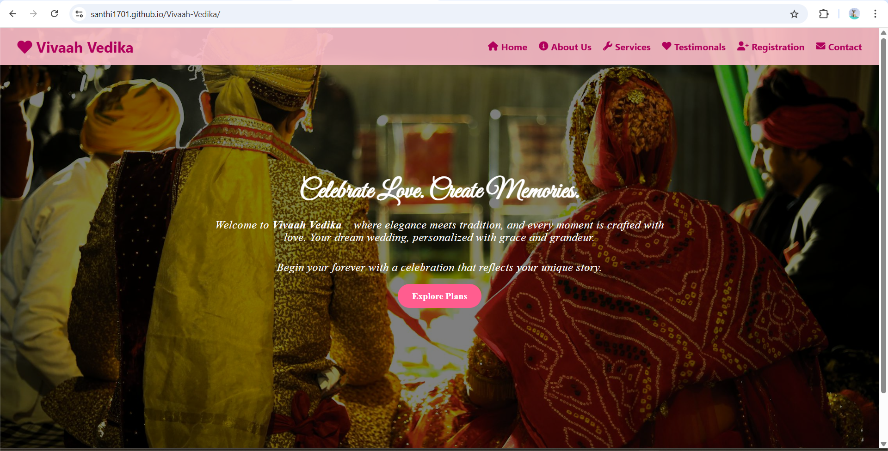
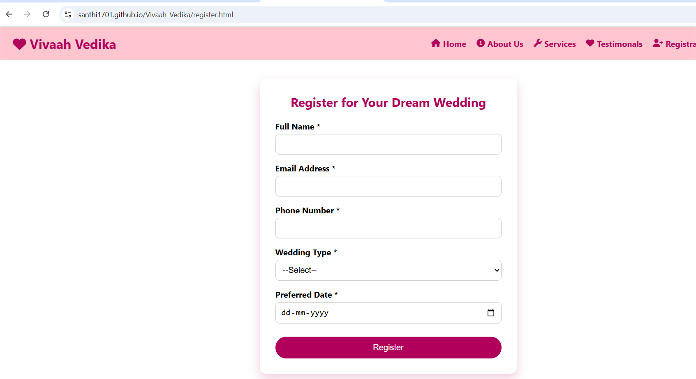

# 💖 Vivaah Vedika - Wedding Event Website

**Vivaah Vedika** is a beautifully crafted **frontend wedding event website** designed to showcase various types of wedding services and allow users to register for their dream wedding. Built using only **HTML, CSS, and JavaScript**, it serves as a fully responsive and elegant portfolio project for frontend development.

---

## 🌐 Live Demo

👉 [Live Demo Link]( https://santhi1701.github.io/Vivaah-Vedika/)

---

## 📸 Screenshots

| Landing Page | Registration Form |
|--------------|-------------------|
|  |  |

---

## 📁 Features

- 🌸 Beautiful landing page with background banner
- 🛎️ List of wedding services (Traditional, Destination, Custom)
- 📝 Interactive registration form with client-side validation
- 📱 Fully responsive design (Mobile + Desktop)
- 💌 Contact form for inquiries
- 💬 Testimonials page for social proof
- 🔗 Navigation bar with all page links and Font Awesome icons
- 🎨 Elegant styling with romantic theme colors (pink & white)

---

## 🛠️ Tech Stack

- ✅ HTML5
- ✅ CSS3 (custom styling, box-shadow, media queries)
- ✅ JavaScript (form validation & interactivity)
- ✅ Font Awesome (icons)
- ✅ Google Fonts (elegant wedding typography)

---

